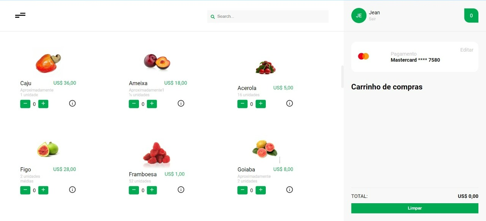
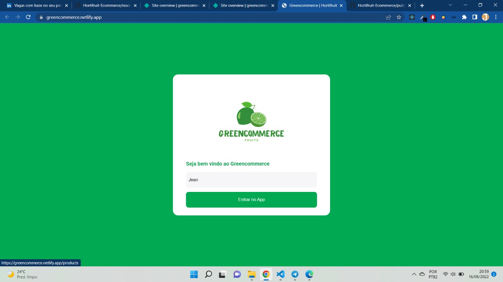

<h1 align="center">
    GreenCommerce

</h1>

<h4 align="center"> 
	:construction:	  GreenCommerce :rocket: em construção... :construction:
</h4>


## :computer: Sobre o projeto
<p>
   GreenCommerce oferece um ambiente online para compra das mais variadas frutas na web, de forma simples e rápida adicione suas frutas ao carrinho de compras e realize o seu pedido 
</p>

## :art: Layout

### Web
<p align="center" style="display: flex; align-items: flex-start; justify-content: center;">
    
    
</p>


## 🛠 Tecnologias

As seguintes ferramentas foram usadas na construção do projeto:

- React JS
    - Context API
    - Styled-components
    - Polished


- TypeScript 
- Axios  


## :rocket: Como executar o projeto

:bulb: Este é um projeto Front End que consome uma API de terceiros, portanto você só precisará executar uma aplicação.

### Pré-requisitos

Antes de começar, você vai precisar ter instalado em sua máquina as seguintes ferramentas:
Git, Node.js. 
Além disto é bom ter um editor para trabalhar com o código como VSCode.


### :new_moon_with_face: Rodando a aplicação  

```bash
# Clone este repositório
$ git clone https://github.com/JeanVictor44/Hortifruit-Ecommerce

# Acesse a pasta do projeto no seu terminal/cmd
$ cd Hortifruit-Ecommerce

# Instale as dependências
$ npm install

# Execute a aplicação em modo de desenvolvimento
$ npm run start
      ou
$ yarn dev

# A aplicação será aberta na porta:3000 - acesse http://localhost:3000
```
